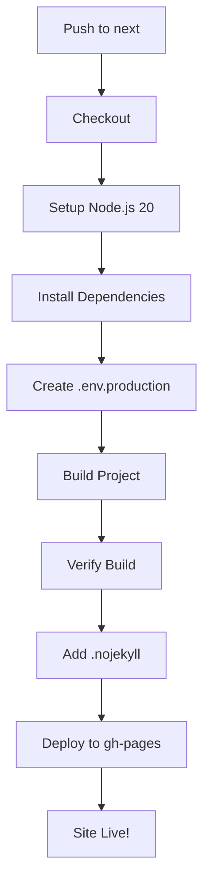

# Deploy Next Branch to gh-pages

**Deployment Strategy:** `next` branch → `gh-pages` branch

## 🎯 Overview

This workflow automatically deploys your portfolio from the `next` branch to the `gh-pages` branch whenever you push changes.

## 🔄 Workflow Configuration

### Trigger
- ✅ Push to `next` branch
- ✅ Manual trigger via `workflow_dispatch`

### Deployment Target
- **Source:** `next` branch
- **Destination:** `gh-pages` branch
- **Action:** Uses `peaceiris/actions-gh-pages@v4`

## 📋 What Happens on Push

When you push to the `next` branch:

1. **Checkout** - Fetches your repository with full history
2. **Setup Node.js 20** - Installs Node.js with npm caching
3. **Install Dependencies** - Runs `npm ci` for clean install
4. **Create Environment** - Generates `.env.production` with your secrets
5. **Build** - Runs `npm run build:prod`
6. **Verify** - Checks that `dist/` and `index.html` exist
7. **Add .nojekyll** - Ensures GitHub Pages doesn't ignore underscore files
8. **Deploy** - Pushes `dist/` contents to `gh-pages` branch

## 🚀 Quick Setup

### 1. Configure GitHub Secrets
```
Repository → Settings → Secrets and variables → Actions
```

**Required:**
- `GEMINI_API_KEY` - Your Gemini API key

**Optional (have defaults):**
- `VITE_ENABLE_CHATBOT` (default: `true`)
- `VITE_ENABLE_DYNAMIC_CONTENT` (default: `true`)
- `VITE_SHOW_RECOMMENDED_SECTIONS` (default: `true`)

### 2. Enable GitHub Pages
```
Repository → Settings → Pages
Source: Deploy from a branch
Branch: gh-pages / (root)
Save
```

### 3. Push to Deploy
```bash
# Make your changes on next branch
git add .
git commit -m "Your changes"
git push origin next

# Deployment automatically triggers!
```

### 4. Monitor Deployment
```
Repository → Actions tab → "Deploy Next Branch to gh-pages"
```

## 🌐 Your Site URL

After deployment, your site will be available at:
```
https://YOUR_USERNAME.github.io/REPOSITORY_NAME
```

## 🔧 Workflow Features

### ✅ Force Orphan
```yaml
force_orphan: true
```
- Creates a clean `gh-pages` branch each time
- No history accumulation
- Smaller repository size

### ✅ Auto .nojekyll
```yaml
- name: Add .nojekyll file
  run: touch dist/.nojekyll
```
- Prevents Jekyll processing
- Ensures all files are served correctly
- Critical for files starting with `_`

### ✅ Bot Commits
```yaml
user_name: 'github-actions[bot]'
user_email: 'github-actions[bot]@users.noreply.github.com'
```
- Clean commit history
- Identifiable automated deployments
- Professional commit messages

### ✅ Build Verification
- Checks `dist/` directory exists
- Verifies `index.html` is present
- Fails fast with clear error messages

## 📊 Workflow Structure



## 🔒 Security

### Permissions
```yaml
permissions:
  contents: write
```
- Only `contents: write` needed
- No additional permissions required
- Secure secret handling

### Production Defaults
All debug features automatically disabled:
- `VITE_SHOW_DEV_ELEMENTS=false`
- `VITE_SHOW_VISITOR_CONTROLS=false`
- `VITE_SHOW_PROFILE_INSIGHTS=false`
- `VITE_SHOW_TRANSLATION_DEBUG=false`
- `VITE_SHOW_DEBUG_INFO=false`

## 🧪 Testing Locally

Before pushing, test your production build:

```bash
# Build
npm run build:prod

# Preview
npm run preview:prod

# Visit: http://localhost:5177
```

## 🐛 Troubleshooting

### Deployment Fails

**Error:** "Resource not accessible by integration"

**Solution:**
1. Go to Settings → Actions → General
2. Set "Workflow permissions" to "Read and write permissions"
3. Save and retry

### gh-pages Branch Not Created

**Error:** No gh-pages branch after deployment

**Solution:**
1. Check Actions tab for errors
2. Ensure workflow completed successfully
3. Verify `GITHUB_TOKEN` has correct permissions
4. Try manual trigger via workflow_dispatch

### Site Shows 404

**Error:** Site loads but shows 404

**Solution:**
1. Go to Settings → Pages
2. Ensure Source is set to "Deploy from a branch"
3. Select `gh-pages` branch and `/ (root)`
4. Wait 2-3 minutes for propagation
5. Clear browser cache

### Build Verification Fails

**Error:** "dist directory not found!"

**Solution:**
1. Check build logs in Actions tab
2. Test build locally: `npm run build:prod`
3. Verify `vite.config.ts` output directory
4. Check for build errors in the logs

### Assets Not Loading (404 on CSS/JS)

**Error:** Site loads but CSS/JS fail to load

**Solution:**
1. Check if `.nojekyll` file exists in deployed branch
2. Verify base path in `vite.config.ts`
3. For user/org pages: `base: '/'`
4. For project pages: `base: '/repository-name/'`

## 📁 Deployment Structure

After deployment, your `gh-pages` branch will contain:

```
gh-pages/
├── .nojekyll
├── index.html
├── assets/
│   ├── index-[hash].js
│   ├── index-[hash].css
│   ├── react-vendor-[hash].js
│   ├── three-vendor-[hash].js
│   ├── i18n-vendor-[hash].js
│   └── ...
├── sw.js
├── sw-v2.js
└── manifest.json
```

## 🔄 Manual Deployment

You can manually trigger deployment without pushing:

1. Go to Actions tab
2. Click "Deploy Next Branch to gh-pages"
3. Click "Run workflow"
4. Select `next` branch
5. Click "Run workflow"

## 📈 Comparison: GitHub Actions vs gh-pages

| Feature | GitHub Actions (New) | gh-pages Branch (Current) |
|---------|---------------------|---------------------------|
| Deployment Target | GitHub Pages API | gh-pages branch |
| Setup Complexity | Moderate | Simple |
| Branch History | Not applicable | Clean (force_orphan) |
| Deployment Speed | Fast | Fast |
| Customization | Limited | Full control |
| Traditional Approach | ❌ No | ✅ Yes |
| Works with Classic Pages | ❌ No | ✅ Yes |

## ✅ Verification Checklist

After first deployment:
- [ ] Workflow completed successfully
- [ ] `gh-pages` branch created
- [ ] `.nojekyll` file present in gh-pages
- [ ] Site loads at GitHub Pages URL
- [ ] All assets load correctly
- [ ] No 404 errors
- [ ] Chatbot works (if enabled)
- [ ] All translations load
- [ ] Service worker registers
- [ ] PWA installable

## 🎉 Benefits of gh-pages Branch Deployment

### ✅ Traditional & Reliable
- Time-tested approach
- Wide support and documentation
- Easy to understand

### ✅ Full Control
- Direct access to deployed files
- Can inspect gh-pages branch
- Easy debugging

### ✅ Force Orphan
- Clean deployment each time
- No history bloat
- Smaller repository size

### ✅ Compatible
- Works with all GitHub Pages setups
- No special configuration needed
- Classic approach that always works

## 📚 Related Documentation

- [Deployment Quick Start](./DEPLOYMENT_QUICK_START.md)
- [GitHub Pages Deployment Guide](./GITHUB_PAGES_DEPLOYMENT.md)
- [Workflow Update Summary](./WORKFLOW_UPDATE_SUMMARY.md)
- [Environment Variables Guide](./GITHUB_ENV_GUIDE.md)

## 🆘 Need Help?

1. Run verification: `npm run deploy:verify`
2. Check Actions logs for errors
3. Review this documentation
4. Check GitHub Pages settings

## 📝 Workflow File Location

`.github/workflows/deploy.yml`

## 🎯 Summary

Your deployment workflow:
- ✅ Deploys from `next` branch
- ✅ Pushes to `gh-pages` branch
- ✅ Uses force_orphan for clean history
- ✅ Adds .nojekyll automatically
- ✅ Includes build verification
- ✅ Professional bot commits
- ✅ Ready to use!

**Push to `next` and watch your site deploy automatically!** 🚀

---

**Last Updated:** October 3, 2025  
**Deployment Method:** `next` → `gh-pages`  
**Status:** ✅ Production Ready

